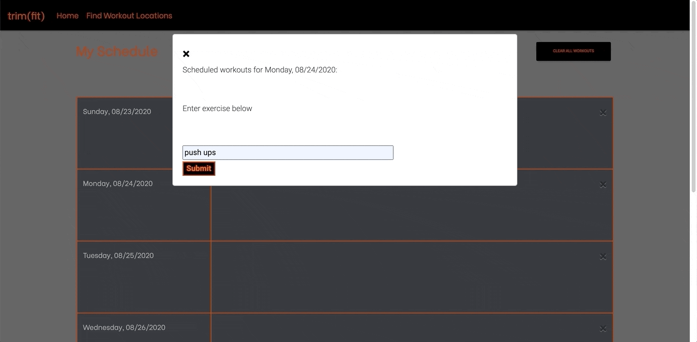
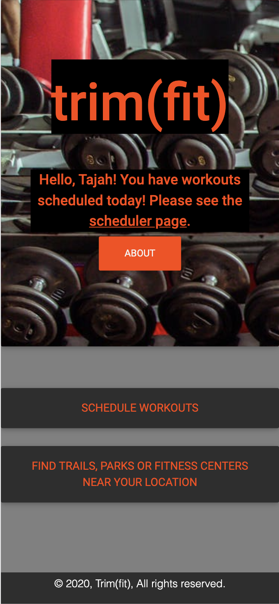
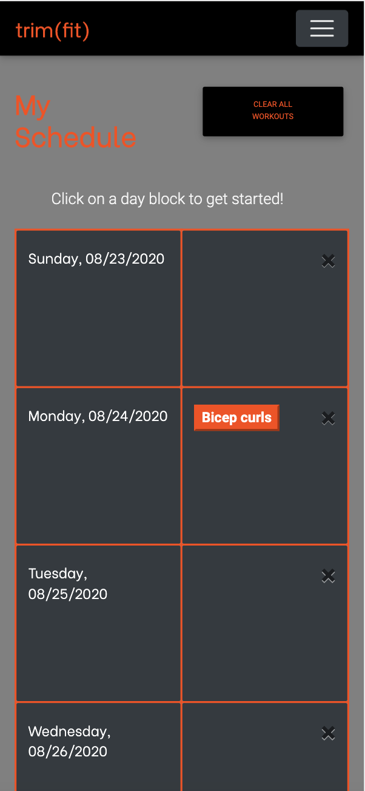
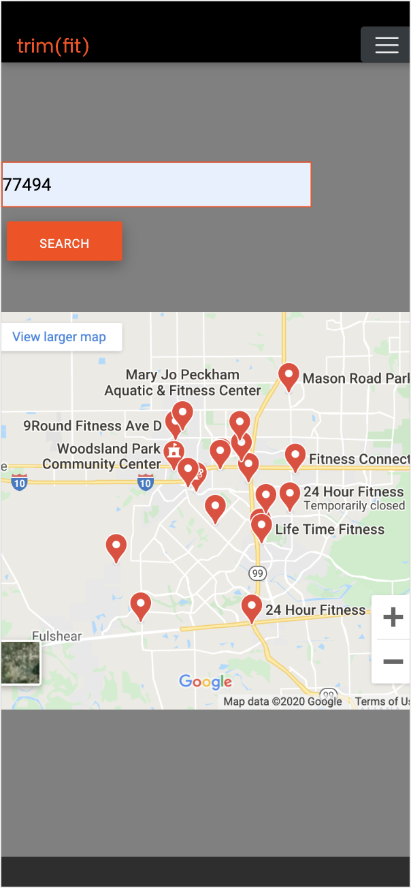

# Fitness Application: trim(fit)

## Overview ##

The purpose of this project was to create a mobile-friendly fitness application with the help of multiple third-party APIs. The user is presented with an easy-to-use product while still maintaining optimum functionality. 

**LIVE LINK:**

## User Story ##

>AS A beginner in fitness  
I WANT workout ideas and how-to tutorials to schedule for the week  
SO THAT I can keep track of what I'm doing and when I'm doing it  
I ALSO WANT to have set reminders of scheduled workouts  
SO THAT I do not forget to workout and I am held accountable in completing that workout

>AS A person with a busy schedule  
I WANT to be able to schedule my workouts  
SO THAT I can set aside time for my health  
I ALSO WANT a way to delete scheduled workouts  
SO THAT I can remove a routine and reschedule just in case I am too busy that day or week

## APIs Used ##

* [YouTube](https://developers.google.com/youtube/v3)
* [Google Maps](https://cloud.google.com/maps-platform/?utm_source=google&utm_medium=cpc&utm_campaign=FY18-Q2-global-demandgen-paidsearchonnetworkhouseads-cs-maps_contactsal_saf&utm_content=text-ad-none-none-DEV_c-CRE_289918047742-ADGP_Hybrid+%7C+AW+SEM+%7C+BKWS+~+Google+Maps-KWID_43700036076725534-kwd-21146297871-userloc_9061130&utm_term=KW_%2Bgoogle%20%2Bmaps-ST_%2Bgoogle+%2Bmaps&gclid=Cj0KCQjwhIP6BRCMARIsALu9LflbTJufz_6CLAk6UOvLePUH_2gYGbyMz7GULPWiwbFapXGnFjBVmV0aAkytEALw_wcB)
* [Giphy](https://developers.giphy.com/)
* [Moment.js](https://momentjs.com/)

## CSS Framework Used ##

* [Material Design Bootstrap](https://mdbootstrap.com/docs/jquery/)

## Home Page ##

**Style: index.html and style.css**

The color palette of the trim(fit) app is a contrast of orange, grey and black. 
The homepage can be divided into 3 parts:
1. A Jumbotron with a background image(using Material Design Bootstrap) contains the App title, a greeting message(not for first time users) and a collapseable About button.
2. The main body of the homepage has 3 buttons - A "Get Started" Button(for First time users only), "Schedule your workout" Button(that takes the user to the scheduler page) and "Find parks and fitness centers" button (that takes the user to the Maps page).
3. A sticky footer with a Copyright notice

**Functionality: Script.js** 

Upon landing on the home page, the user's experience will differ slightly based on whether or not they have provided and submitted their name through the "Get Started" modal.

If the user has not yet submitted their name, they will be presented with the "Get Started" button. Clicking "Get Started" will cause a modal to appear prompting the user to enter their name with a short description of the app and its uses. Once the user clicks submit, the modal will clear and then render welcome text with a set animated gif. The home page will also render a greeting under the brand name in the top part of the page. The user can exit the modal simply by clicking the close icon in the top left corner of the modal, and the get started button will not render to the user again (unless they clear their username from local storage)

If the user has submitted their name, they will have a small greeting message below the brand name in the top part of the page. When the user loads the page, the app loops through the user's local storage to see if any local storage keys match the current date. If the user does not have any keys that match the current date in their local storage, the greeting will inform them that they have no scheduled workouts for that day. If the user DOES have a local storage key that matches the current date, the greeting will inform them that scheduled workouts exist, and provides a hyperlink to the scheduler page.

## Scheduler Page ##

**Style: scheduler.html and scheduler.css**

The scheduler page has a simple, sleek style that is cohesive with the home and map pages. The entire page is mobile responsive so that it is easily accessible and viewed by users on the go. 

The navbar allows the user to easily navigate through the application. It also contains a table to serve as the actual scheduler with the first column being the day block and the second column being the workout plan. 

When hovered, the specific day block transitions colors and is highlighted so that the user knows that it is meant to be clicked. There is also a message at the top of the scheduler that states to click the day block for scheduling in case the user is on their phone or tablet. A modal to enter the workout or tutorial desired is displayed once the day block is clicked. 

After the user submits their workout plan, it is then appended onto the second column. The user will be able to access many YouTube videos (shown using a modal) related to the workout by simply clicking the plan that was appended to the page. The plan also changes colors when hovered over so that the user knows it is being selected.

If the user decides to delete a workout, it can be done two ways: clicking the "x" button in each plan block or clicking the "Clear All Workouts" button in the top right-hand corner of the page. The "x" button will transition colors when it is hovered over and the "Clear All Workouts" button will cast a darker shadow and press down when clicked. 

Finally, the user can switch through weeks (moving forward or backward in time) by clicking on the angle brackets at the bottom of each page. 

**Functionality: scheduler.js**

On page load, a table renders rows for each day of the week with two columns each - one that displays the weekday and date, and the other that will render buttons for workouts entered by the user. When the page is loaded, local storage is checked to see if any workouts for the currently displayed days exist, arrays are created for values of keys that do match displayed dates, and a button is rendered in the second row of the appropriate column for each item in that array.

The first column of each row is clickable- doing so will show a modal to the user displaying any workouts the user has already scheduled for the current day (the section where the workouts exist will be blank if the user has none). The modal also provides the user the ability to enter a workout and submit it. Once the user does this, the workout list in the modal is dynamically updated, and a button for that workout is also rendered in the second column of that date's row. Local storage will also store the workout list as a value with the key being the date of the date block clicked to make the modal appear. This workout list store happens regardless of whether or not a key with that respective date exists so that local storage will simply update the value of that key even if it already exists.

Users have two methods of clearing these workouts from the calendar: a time row-specific clear and a global clear. 

The time row clear is triggered by a close icon in the top right corner of the second column in each row. This clear button will clear the local storage of the item whose key matches the date of the first column in that row and removes all workout buttons from that row's second column.

The global clear, labeled "Clear All Workouts", stores the username value (if one exists), clears all of local storage and deletes all displayed workout buttons in each row, and then re-enters the stored username value with the existing "username" key name.

At the bottom of the page, the user has "<" and ">" icons. 

Clicking the "<" icon will go to the previous week from where the user's scheduler currently is and will render buttons for any workouts that exist for any of the dates in local storage. Clicking the ">" icon will go to the next week from where the user's scheduler currently is and will render buttons for any workouts that match those new dates.

Lastly, clicking the workout buttons will trigger a YouTube API response and render 3 videos from youtube in a modal with the workout button's text as the search subject.

## Map Page ##

**Style: maps.html and style.css**

The map page adheres to the same color scheme as the rest of the application with a nav-bar that allows users access to the home and scheduler pages. The body of the page contains a input field that requires the user to enter zip-code followed by a Search Button.
When the user clicks the search Button, the page displays a google map with all the parks and fitness centers around the zip address.

**Functionality: maps.js**

When the search button is clicked an onclick funtion is called that gets the zipcode from the input text area and adds it to the google maps url which contains the API key.
When the URL of the iframe Element is updated, it displays the Map on the html page. 

## Demos ##

.gif)

## Mobile Images ##

